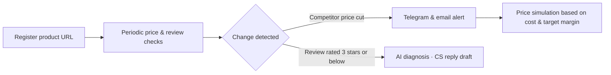
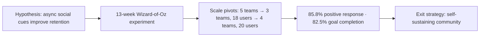

  

  

<a href="https://github.com/SUNWOOKLEE04">🇰🇷 한국어</a> · <b>🇺🇸 English</b>

  

 

 

## 🧑‍💼 About

**A product planner who understands engineering and builds to validate.** I'm a second-year Computer Science student pursuing a career in product management.

I enjoy defining problems, forming hypotheses, validating them through real user behavior, and deciding what comes next. I care less about writing feature specs and more about "what should we build, and why" and "how do we validate and grow it."

My CS background lets me speak the same language as engineers, and when it helps, I build MVPs myself with AI coding agents to test the market. Right now I'm taking **SellerGuard**, a SaaS for e-commerce sellers, from idea to launch on my own. I'm exploring opportunities both in Korea and globally.

| 📍 Location | 🎯 Focus | 🤝 Status |
| :---: | :---: | :---: |
| South Korea | Product Planning & AI | Open to Work (KR / Global) |

 

<table>
<tr>
<td align="center" width="25%"><h3>🏆 Grand Prize</h3>Change Maker TR2 design-thinking project</td>
<td align="center" width="25%"><h3>🧪 13 weeks</h3>behavioral experiment with no development</td>
<td align="center" width="25%"><h3>📈 85.8%</h3>positive response to Ghost Ping (n=28)</td>
<td align="center" width="25%"><h3>🚀 Oct 2026</h3>SellerGuard SaaS launch target</td>
</tr>
</table>

 

## 🧭 Quick Look

| Year | Project | Role | Key Result |
| :---: | --- | :---: | --- |
| **2026.10** | SellerGuard | Founder · Planner | Planned and built an MVP of a price & review monitoring SaaS for Smart Store sellers, **launching Oct 2026** |
| **2026.09~** | GDGoC | Member | Joined Google Developer Groups on Campus |
| **2026.08** | Change Maker TR2 | Product Planner | **Grand Prize** for an SDG design-thinking project · planned a direct-to-campus B2B platform for fishers |
| **2026** | Planfit Case Study | Product Planner | 13-week experiment with no development · **85.8%** positive response to Ghost Ping · **45.2%** hybrid workout rate |
| **2026.06~07** | AI Grand ICT Bootcamp | Learner | **Completed** a 160h deep learning & GenAI program |
| **2025.02~** | Robotics & Coding Club | Coding Instructor | Coached students for USACO & AI SW competitions · mentored multiple projects |
| **2024** | CAHLP Company | Tech Planning | Contributed to MOU partnerships through IT proposals |
| **2021** | AI PE Attendance System | Product Planner | **Superintendent of Education Award**, Busan AI Competition |
| **2021** | Barrier-free Kiosk | Product Planner | **Design Excellence Award**, ICT Hackathon |

 

## 🛡️ Flagship · SellerGuard

 

**Price & review monitoring SaaS for Naver Smart Store sellers** · 🔗 [sellerguard.kr](https://sellerguard.kr)

<!-- TODO: after uploading screenshots/GIF to the repo's assets folder, uncomment below

  
  

-->

**Problem** · Smart Store sellers have to manually watch for sudden competitor price cuts and new negative reviews, so they react late and lose margin and store trust in the meantime.

**Target & Positioning** · Small, often solo sellers in price-competitive categories. Rather than adding features, I focused the product on one promise: **"defend the lowest price without losing margin."**

**Solution Flow**

**Product Decisions**

- **Minimal setup** · Sellers get alerts with just a Telegram Chat ID, no API keys
- **Trust safeguards** · AI replies are constrained from promising unapproved refunds or compensation
- **Revenue model** · Three subscription tiers based on number of monitored products and check frequency
- **Fast validation** · Built the MVP myself with AI coding agents such as Antigravity and Claude Code, without an engineering team

**Next (Post-launch Validation Plan)**

- Validate the core value with beta sellers → convert to paid
- Track the funnel: trial sign-up → first alert → paid conversion → churn
- Results will be added here as real numbers

 

## 🚀 Journey

<h3>2026 · Product Planning & Applied AI</h3>

### GDGoC — Google Developer Groups on Campus

 

- **Overview** · Active since September 2026 in GDGoC, a university developer community that learns and builds projects around Google developer technologies
- **Purpose** · Joined to work alongside developers on the same team, deepen my understanding of engineering, and experience firsthand where planning meets development

---

### Interuniversity Change Maker TR2 — 'Today-sea' Direct-to-Campus B2B Platform

 

**Overview** · A cross-university exchange program under a university innovation initiative (Aug 10–12, 2026, 3 days/2 nights, Damyang). Ran a team project applying design thinking to real-world issues under the theme of the Sustainable Development Goals (SDGs).

**Problem** · Seafood that is still edible is routinely discarded at scale simply because it doesn't meet market-grade or size standards, while consumers pay inflated prices for fresh seafood due to markups at each layer of the distribution chain.

**Strategy** · Designed a B2B platform that connects fishers directly with university commercial districts (dense hubs of students and single-person households), compressing the multi-tier distribution chain into a **single direct-supply step**. Reframed the problem as a two-sided market: fishers offload otherwise-discarded catch at low cost, while students get seafood below market price.

**Activities**
- Design-thinking project: topic selection → empathize (interviewed both fishers and university-district consumers) → define → prototype & user testing → final presentation
- Collaborative workshop exploring SDG messaging through local cultural resources and creative problem-solving
- Team-building and cross-disciplinary collaboration with students from another university

**Impact** · Planned and prototyped **'Today-sea'**, rescuing discarded catch and compressing distribution to a single step ➔ **Won the Grand Prize** at the final showcase.

**Purpose** · To practice rapid hypothesis validation and cross-functional communication by defining a problem and building a prototype with students from different majors in a short timeframe.

🔗 [Repo](https://github.com/SUNWOOKLEE04/Today-sea)

---

### Planfit Case Study — Global User Retention & Social Feature Strategy

 

A self-initiated case study from the PHALANX planning club.

**Problem** · To enter the US market and improve retention, the fitness app Planfit needs a sustainable workout structure.

**Hypothesis** · An asynchronous social mechanic that lets users feel each other's workouts without being online together would improve retention.

**Execution**
- Planned async social features driven by user feedback, such as 'Ghost Sync' and 'achievement-rate sync'
- Published a 5-part series of strategy articles
- Designed text-based Ghost Sync logic with no development resources and validated it over 13 weeks via a Wizard-of-Oz MVP
- Pivoted experiment scale from 5 teams → 3 teams (18 users) → 4 teams (20 users), collecting data via KakaoTalk open chats and an auto-aggregating Google Forms/Sheets dashboard

**Impact**
- **85.8%** positive response to Ghost Ping (n=28)
- **45.2%** hybrid (home/outdoor) workout verification rate
- **82.5%** goal-completion rate
- Drove a rebound from the day-4 engagement low (40 pts) to 70 pts on day 5 through timed manual intervention
- Designed an **exit strategy** into a self-sustaining community by removing mandatory check-ins and opening friend invites
- Validated hypotheses before implementation, reducing execution risk through behavioral experiments

---

### Deep Learning Fundamentals & Applied Generative AI

 

**Overview** · A 160-hour intensive program (8h × 5 days × 4 weeks, Jun 24 – Jul 22, 2026) hosted by the AI Grand ICT Research Center and organized by Busan IT Industry Promotion Agency.

**Curriculum**
- ML/DL fundamentals: data preprocessing, regression/classification/ensembles, MLP/DNN & backpropagation, CNN/RNN/LSTM, and Transformer architecture
- Applied Generative AI: AI agent concepts, prompt design (ROCK framework), Gemini API & Supabase API integration, building applications via vibe coding
- Team project: collaborative build using a generative AI / deep learning theme

**Purpose** · To see firsthand where AI products are technically feasible and where they break down, so my conversations with engineering teams stay grounded in reality.

<h3>2025 · Mentoring & Observing Users</h3>

### Coding & Robotics Instructor — Robotics & Coding Club

 

**Overview** · Coding & Robotics Instructor at a Robotics & Coding Club academy since February 2025 (currently active).

**Activities** · Designed project-based curricula tailored to each student's interests and level, provided 1:1/small-group mentoring, and coached students preparing for competitions.

**Competition Coaching**
- Coached one student all the way to competing in **USACO (USA Computing Olympiad)** / **AI SW Creative Thinking Competition**
- Also coaching several other students at their own level for coding/robotics competitions → resulting in multiple **competition entries and wins**

**Project Highlights** (a sample, not the full list)

| Project | Description | Link |
| --- | --- | :---: |
| AI-Powered Smart Bandage Platform (2025) | QR + web prototype using the Gemini Vision API to assess wound conditions | [Repo](https://github.com/SUNWOOKLEE04/ai-wound-assessment-tool) |
| Collaborative Student Portfolio Platform (2025) | A 10+ page responsive portfolio site built by a 3-person student team | [Repo](https://github.com/SUNWOOKLEE04/student-portfolio) |
| Python RPG Text Game (2025) | A turn-based RPG built to reinforce foundational Python skills | [Repo](https://github.com/Daniel-choi-11/Python-RPG-text-game) |
| BOYNEXTDOOR Lovers Attendance Project (Jun 2026) | A check-in/schedule console app built with an elementary-school student around their favorite idol group, using dictionary-based password/schedule binding, list unpacking, and `.strip()` input guards | [Repo](https://github.com/BBIO-0530/BOYNEXTDOOR-LOVERS-ATTENDANCE-PROJECT) |

※ These are representative examples — several more student projects are in progress beyond this list.

Building a curriculum around what keeps a student engaged starts from the same place product design does: watching how people behave, not assuming how they will. Sustained since February 2025, alongside coursework and university-transfer preparation.

---

### PHALANX Planning Club (2025~)

The planning club behind the Planfit case study above; active since 2025.

<h3>2024 · Business & Tech Planning</h3>

### CAHLP Company — Tech Planning & Partnership Building

- **Problem & Strategy** · Addressed the company's lack of IT capability by planning a technology roadmap and setting up the frontend environment
- **Business Development** · Conducted B2B networking at K-ICT Week (BEXCO) to explore business expansion
- **Impact** · Contributed to **MOU partnerships** by writing targeted IT proposals

---

### Global Insight & Data/AI Capacity Building

 

- 🌏 **CEBU LCIC Program** (1 month, summer break) — Strengthened English communication through an immersive language program
- 📊 **DSAC M2/M3 Certification** — Data science & AI capacity-building program

<h3>2021 · High School Projects</h3>

### AI Camera-based PE Attendance System

- **Problem** · Limits of attendance tracking in remote PE classes and declining student activity
- **Strategy** · Planned the business logic for AI motion-recognition attendance and coordinated schedules across Dev and Design
- **Impact** · Demonstrated the EdTech MVP's viability ➔ **Superintendent of Education Award**, Busan AI Competition

---

### Intelligent Kiosk for Visually Impaired Users

- **Problem** · Identified accessibility pain points for visually impaired users of public kiosks
- **Strategy** · Planned and prototyped a barrier-free UI/UX with voice recognition and Braille support
- **Impact** · Validated UX improvements for underserved users ➔ **Design Excellence Award**, ICT Hackathon

🔗 [Repository](https://github.com/SUNWOOKLEE04/Intelligent-Kiosk-System)

---

### Adaptive Sports Recommendation System

- **Problem** · Lack of sports infrastructure and information tailored to individuals with disabilities
- **Strategy** · Designed a recommendation service flow using public big data and planned the data-to-app integration
- **Impact** · Showed the value of public data for healthcare services ➔ **Prize Winner**

---

### PNU Datathon

- Planned a team-based data science project and derived actionable insights

 

## 🛠️ Toolkit

  

| Area | Tools |
| --- | --- |
| **Planning & Collaboration** |      |
| **Data & Validation** |     |
| **AI & Prototyping** |       |
| **Engineering Literacy** (used to work closely with engineers) |     |

 

## 📖 Current Focus

     

 

  

