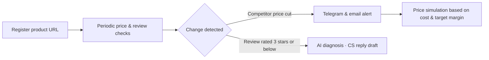
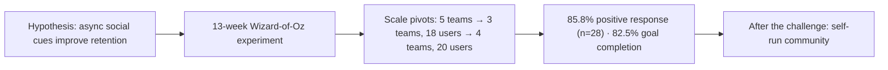

  

  

<a href="https://github.com/SUNWOOKLEE04">🇰🇷 한국어</a> · <b>🇺🇸 English</b>

  

 

 

## 🧑‍💼 About

**Understands engineering, builds to validate** 
Second-year Computer Science student · aspiring AI Product Manager (PM)

I enjoy defining problems, forming hypotheses, validating them through real user behavior, and deciding what comes next. I care less about writing feature specs and more about "what should we build, and why" and "how do we validate and grow it."

My CS background lets me speak the same language as engineers, and when it helps, I build MVPs myself with AI coding agents to test the market. Right now I'm planning and building **SellerGuard**, a SaaS for e-commerce sellers, on my own, and turning the teaching materials I made as a coding instructor into a product for other instructors.

| 📍 Location | 🎯 Focus | 🤝 Status |
| :---: | :---: | :---: |
| South Korea | AI Product Management | Open to internships & project collaboration |

 

<table align="center">
<tr>
<td align="center" width="25%"><h3>🏆 Grand Prize</h3>Change Maker TR2 design-thinking project</td>
<td align="center" width="25%"><h3>🧑‍🏫 Since 2025.02</h3>coding & robotics instructor, ongoing</td>
<td align="center" width="25%"><h3>📚 160 hours</h3>deep learning & GenAI program completed</td>
<td align="center" width="25%"><h3>🥇 Award</h3>Superintendent of Education Busan AI Competition (2021)</td>
</tr>
</table>

 

## 🧭 Quick Look

| Year | Project | Role | Key Result |
| :---: | --- | :---: | --- |
| **2026~** | SellerGuard | Solo planning & dev | Price & review monitoring SaaS for Smart Store sellers, **in development** |
| **2026.10** | Instructor Textbooks | Planning & build | Java & web standards textbooks **preparing to sell on Kmong**; Python, C, C++, C# textbooks built |
| **2026.09~** | GDGoC | Member | Joined Google Developer Groups on Campus |
| **2026.08** | Change Maker TR2 | Team member | **Grand Prize** in a 3-day SDG design-thinking team project · direct seafood trade idea |
| **2026** | Planfit Case Study | Club project planning | Ran a 13-week behavioral experiment with no development · small sample (~20 users) |
| **2026.06~07** | AI Grand ICT Bootcamp | Learner | **Completed** a 160h deep learning & GenAI program |
| **2025.02~** | Robot Club Coding Club | Coding Instructor | 1:1 and small-group classes · coached a student to USACO · guided student projects |
| **2021** | AI PE Attendance System | High school team · planning | **Superintendent of Education Award**, Busan AI Competition |
| **2021** | Barrier-free Kiosk | High school team · planning | **Design Excellence Award**, ICT Hackathon |

 

## 🛡️ Flagship · SellerGuard

 

**Price & review monitoring SaaS for Naver Smart Store sellers** · 🔗 [sellerguard.kr](https://sellerguard.kr)

<!-- TODO: after uploading screenshots/GIF to the repo's assets folder, uncomment below

  
  

-->

**Problem** · Smart Store sellers have to manually watch for sudden competitor price cuts and new negative reviews, so they react late and lose margin and store trust in the meantime.

**Target & Positioning** · Small, often solo sellers in price-competitive categories. Rather than adding features, I focused the product on one promise: **"defend the lowest price without losing margin."**

**Solution Flow**

**Product Decisions**

- **Minimal setup** · Sellers get alerts with just a Telegram Chat ID, no API keys
- **Trust safeguards** · AI replies are constrained from promising unapproved refunds or compensation
- **Revenue model** · Three subscription tiers based on number of monitored products and check frequency
- **Fast validation** · Built the MVP myself with AI coding agents such as Antigravity and Claude Code, without an engineering team

**Next (What I will check after launch)**

- Validate the core value with beta sellers → convert to paid
- Track the funnel: trial sign-up → first alert → paid conversion → churn
- Results will be added here as real numbers

 

## 🚀 Journey

<h3>2026 · Product Planning & Applied AI</h3>

### Turning My Teaching Materials into a Product — AP CSA Java & Web Standards Textbooks

 

**Problem I ran into** · As a coding instructor, I saw that preparing a subject for the first time, or one outside your major, takes a lot of time, and class quality varies from instructor to instructor.

**What I built** · Six web textbooks an instructor can put on screen and teach from right away: Java and web standards (preparing to sell) plus Python, C, C++, C# (built). Made with AI coding agents; I reviewed the content and examples myself
- Teacher notes (how to explain, expected questions, timing), presentation mode, and a lesson-by-lesson schedule
- Student and answer-key worksheets, exercises, and quizzes
- Scripts that actually compile and run the example code to check it
- The Java textbook reflects the 2025-26 AP CSA four-unit redesign

**Packaging** · A free sample to try first, then three license tiers: individual instructor, small academy, and whole academy

**Status** · Refining it in my own classes and preparing to sell on Kmong. Sales results will be added here as numbers.

---

### GDGoC — Google Developer Groups on Campus

 

- **Overview** · Active since September 2026 in GDGoC, a university developer community that learns and builds projects around Google developer technologies
- **Purpose** · Joined to work alongside developers on the same team, deepen my understanding of engineering, and experience firsthand where planning meets development

---

### Interuniversity Change Maker TR2 — 'Today-sea' Direct Seafood Trade Idea

 

**Overview** · A cross-university exchange program under a university innovation initiative (Aug 10–12, 2026, 3 days/2 nights, Damyang). Ran a team project applying design thinking to real-world issues under the theme of the Sustainable Development Goals (SDGs).

**Problem** · Seafood that is still edible is routinely discarded at scale simply because it doesn't meet market-grade or size standards, while consumers pay inflated prices for fresh seafood due to markups at each layer of the distribution chain.

**Idea** · A direct-trade platform that takes seafood that would otherwise be thrown away straight from fishers and sells it below market price to students and single-person households near campus.

**Activities**
- Design-thinking project: topic selection → empathize (interviewed both fishers and university-district consumers) → define → prototype & user testing → final presentation
- Collaborative workshop exploring SDG messaging through local cultural resources and creative problem-solving
- Team-building and cross-disciplinary collaboration with students from another university

**Result** · As a team, we planned the 'Today-sea' idea, built a prototype, and **won the Grand Prize** at the final presentation.

**Purpose** · To try defining a problem and building a prototype in a short time with students from different majors.

🔗 [Repo](https://github.com/SUNWOOKLEE04/Today-sea)

---

### Planfit Case Study — Asynchronous Social Feature Experiment

 

A self-initiated case study from the PHALANX planning club; not affiliated with Planfit.

**Question** · If the fitness app Planfit entered the US market, what would help users keep working out consistently?

**Hypothesis** · An asynchronous social mechanic that lets users feel each other's workouts without being online together would improve retention.

**Execution**
- Planned async social features driven by user feedback, such as 'Ghost Sync' and 'achievement-rate sync'
- Published a 5-part series of planning articles
- Designed text-based Ghost Sync logic with no development resources and validated it over 13 weeks via a Wizard-of-Oz MVP
- Pivoted experiment scale from 5 teams → 3 teams (18 users) → 4 teams (20 users), collecting data via KakaoTalk open chats and an auto-aggregating Google Forms/Sheets dashboard

**Results** (from a small experiment with about 20 participants)
- **85.8%** positive response to Ghost Ping (n=28)
- **45.2%** hybrid (home/outdoor) workout verification rate
- **82.5%** goal-completion rate
- Engagement dropped to 40 pts on day 4; after I stepped in manually, it recovered to 70 pts on day 5
- After the challenge, removed mandatory check-ins and opened friend invites so the group could run on its own
- Practiced testing a hypothesis with a behavioral experiment before any development

---

### Deep Learning Fundamentals & Applied Generative AI

 

**Overview** · A 160-hour intensive program (8h × 5 days × 4 weeks, Jun 24 – Jul 22, 2026) hosted by the AI Grand ICT Research Center and organized by Busan IT Industry Promotion Agency.

**Curriculum**
- ML/DL fundamentals: data preprocessing, regression/classification/ensembles, MLP/DNN & backpropagation, CNN/RNN/LSTM, and Transformer architecture
- Applied Generative AI: AI agent concepts, prompt design (ROCK framework), Gemini API & Supabase API integration, building applications via vibe coding
- Team project: collaborative build using a generative AI / deep learning theme

**Purpose** · To see firsthand where AI products are technically feasible and where they break down, so my conversations with engineering teams stay grounded in reality.

<h3>2025 · Mentoring & Observing Users</h3>

### Coding & Robotics Instructor — Robot Club Coding Club

 

**Overview** · Coding & Robotics Instructor at **Robot Club Coding Club**, a robotics & coding academy, since February 2025 (currently active).

**Activities** · Designed project-based curricula tailored to each student's interests and level, provided 1:1/small-group mentoring, and coached students preparing for competitions.

**Competition Coaching**
- Coached one student all the way to competing in **USACO (USA Computing Olympiad)** / **AI SW Creative Thinking Competition**
- Coaching several other students for coding and robotics competitions at their own level
- Teaching with my own textbooks (see "Turning My Teaching Materials into a Product" above)

**Student Projects I Guided** (built by students, a sample)

| Project | Description | Link |
| --- | --- | :---: |
| AI-Powered Smart Bandage Platform (2025) | QR + web prototype using the Gemini Vision API to assess wound conditions | [Repo](https://github.com/SUNWOOKLEE04/ai-wound-assessment-tool) |
| Collaborative Student Portfolio Platform (2025) | A 10+ page responsive portfolio site built by a 3-person student team | [Repo](https://github.com/SUNWOOKLEE04/student-portfolio) |
| Python RPG Text Game (2025) | A turn-based RPG built to reinforce foundational Python skills | [Repo](https://github.com/Daniel-choi-11/Python-RPG-text-game) |
| BOYNEXTDOOR Lovers Attendance Project (Jun 2026) | A check-in/schedule console app built with an elementary-school student around their favorite idol group, using dictionary-based password/schedule binding, list unpacking, and `.strip()` input guards | [Repo](https://github.com/BBIO-0530/BOYNEXTDOOR-LOVERS-ATTENDANCE-PROJECT) |

※ Some repos live on my account for class management, but all of them are student work.

Building a curriculum around what keeps a student engaged starts from the same place product design does: watching how people behave, not assuming how they will. Sustained since February 2025, alongside coursework and university-transfer preparation.

---

### PHALANX Planning Club (2025~)

The planning club behind the Planfit case study above; active since 2025.

<h3>2024 · Industry Collaboration & Capacity Building</h3>

### CAHLP Industry-Partnered Club — B2B Business Experience

- **B2B Networking** · Took part in K-ICT Week (BEXCO), connecting with IT companies and seeing B2B business up close
- **Club Assignments** · Built practice apps ([toonflix](https://github.com/SUNWOOKLEE04/toonflix), [naver_map_weather](https://github.com/SUNWOOKLEE04/naver_map_weather))

---

### Language Program & Data/AI Course

 

- 🌏 **CEBU LCIC Program** (1 month, summer break) — Strengthened English communication through an immersive language program
- 📊 **DSAC M2/M3 Certification** — Data science & AI capacity-building program

<h3>2021 · High School Projects</h3>

### AI Camera-based PE Attendance System

High school team project · planning role

- **Problem** · Attendance was hard to check in remote PE classes, and students were less active
- **What I did** · Planned a service flow that takes attendance automatically with AI motion recognition, and coordinated the team schedule
- **Result** · **Superintendent of Education Award**, Busan AI Competition

---

### Intelligent Kiosk for Visually Impaired Users

High school team project · planning role

- **Problem** · Visually impaired users struggle to use kiosks on their own
- **What I did** · Planned kiosk screens with voice recognition and Braille support, and built a prototype
- **Result** · **Design Excellence Award**, ICT Hackathon

🔗 [Repository](https://github.com/SUNWOOKLEE04/Intelligent-Kiosk-System)

---

### Adaptive Sports Recommendation System

High school team project · planning role

- **Problem** · People with disabilities have trouble finding sports programs that suit them
- **What I did** · Planned a recommendation service flow using public data
- **Result** · **Prize Winner**

---

### PNU Datathon

- Took part in a team data analysis project

🔗 [Repository](https://github.com/SUNWOOKLEE04/2021_PNUAC_AIData)

 

## 🛠️ Toolkit

  

| Area | Tools |
| --- | --- |
| **Use most** |   |
| **Teach & wrote textbooks for** |       |
| **Server & infra** |    |
| **AI dev tools** |     |
| **Automation** |  |
| **Notes & tracking** |   |

 

## 📖 Current Focus

Launching SellerGuard · Selling the instructor textbooks · Studying with developers at GDGoC

 

  

