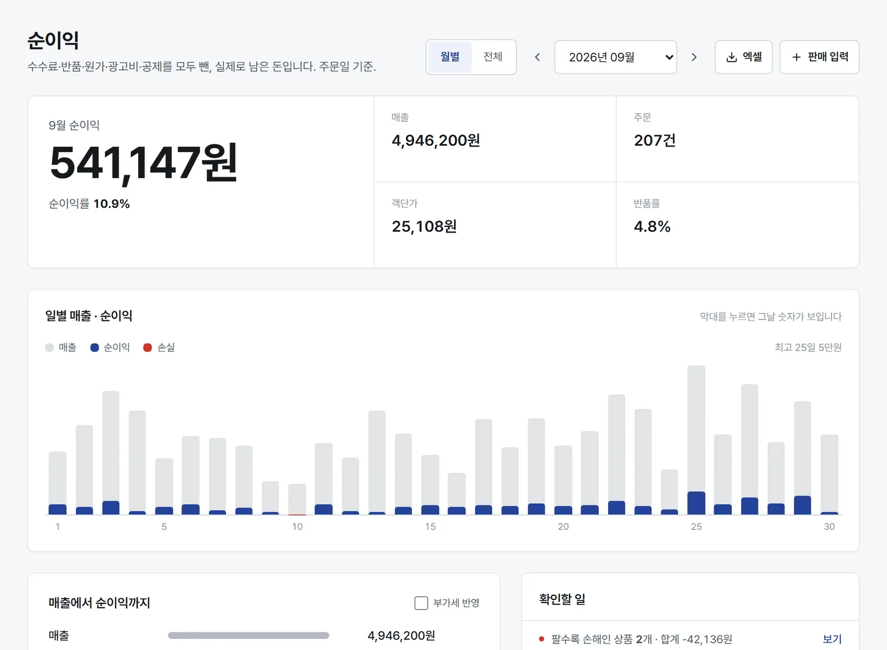
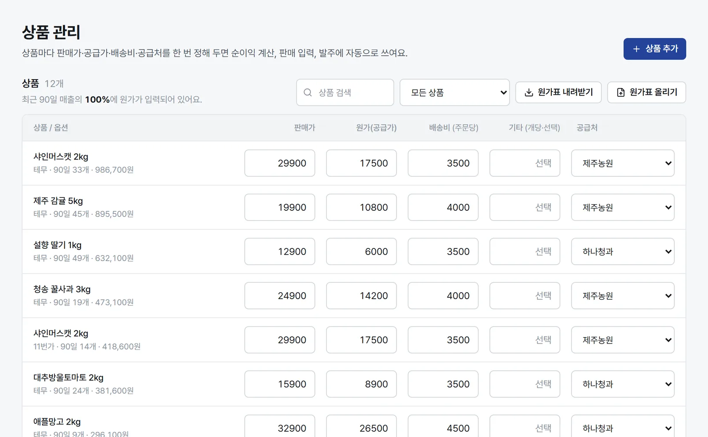
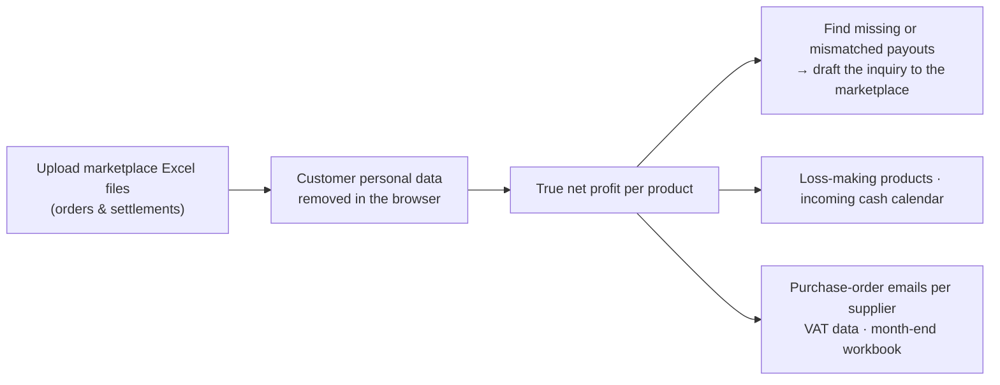
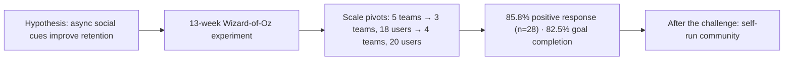

  

  

<a href="https://github.com/SUNWOOKLEE04">🇰🇷 한국어</a> · <b>🇺🇸 English</b>

  

 

 

## 🧑‍💼 About

**Understands engineering, builds to validate** 
Second-year Computer Science student · aspiring AI Product Manager (PM)

I enjoy defining problems, forming hypotheses, validating them through real user behavior, and deciding what comes next. I care less about writing feature specs and more about "what should we build, and why" and "how do we validate and grow it."

My CS background lets me speak the same language as engineers, and when it helps, I build MVPs myself with AI coding agents to test the market. Right now I'm running **SellerGuard**, a SaaS for online sellers that I planned and built on my own, as an open beta, and selling the six textbooks I made as a coding instructor on Kmong while starting a textbook production service for academies.

| 📍 Location | 🎯 Focus | 🤝 Status |
| :---: | :---: | :---: |
| South Korea | AI Product Management | Open to internships & project collaboration |

 

<table align="center">
<tr>
<td align="center" width="25%"><h3>🏆 Grand Prize</h3>Change Maker TR2 design-thinking project</td>
<td align="center" width="25%"><h3>🧑‍🏫 Since 2025.02</h3>coding & robotics instructor, ongoing</td>
<td align="center" width="25%"><h3>📚 160 hours</h3>deep learning & GenAI program completed</td>
<td align="center" width="25%"><h3>🥇 Award</h3>Superintendent of Education Busan AI Competition (2021)</td>
</tr>
</table>

 

## 🧭 Quick Look

| Year | Project | Role | Key Result |
| :---: | --- | :---: | --- |
| **2026~** | SellerGuard | Solo planning & dev | Settlement & net-profit SaaS for online sellers, **open beta live** · pivoted from price monitoring |
| **2026.10~** | Coding Textbooks · Academy Textbook Production | Planning, build & sales | Six textbooks **on sale on Kmong** · pivoted to a production service after academy feedback · [web sample](https://study-202611.netlify.app) live |
| **2026.09~** | GDGoC | Member | Joined Google Developer Groups on Campus |
| **2026.08** | Change Maker TR2 | Team member | **Grand Prize** in a 3-day SDG design-thinking team project · direct seafood trade idea |
| **2026** | Planfit Case Study | Club project planning | Ran a 13-week behavioral experiment with no development · small sample (~20 users) |
| **2026.06~07** | AI Grand ICT Bootcamp | Learner | **Completed** a 160h deep learning & GenAI program |
| **2025.02~** | Robot Club Coding Club | Coding Instructor | 1:1 and small-group classes · coached a student to USACO · guided student projects |
| **2021** | AI PE Attendance System | High school team · planning | **Superintendent of Education Award**, Busan AI Competition |
| **2021** | Barrier-free Kiosk | High school team · planning | **Design Excellence Award**, ICT Hackathon |

 

## 🛡️ Flagship · SellerGuard

 

**One place for online sellers to handle orders, supplier purchase orders, settlements and tax paperwork** · 🔗 [sellerguard.kr](https://sellerguard.kr)

  
  

**Problem** · Sellers on Naver Smart Store and Coupang can see revenue right away, but the money actually left after fees, shipping, ads and product cost only shows up after matching spreadsheets by hand. Each marketplace has its own settlement file, so a missing payout goes unnoticed, and supplier purchase orders and VAT paperwork are rebuilt from scratch every time.

**Target & Positioning** · Small, often solo sellers and dropshippers selling on several marketplaces (Smart Store, Coupang, Temu and others). The first promise is one thing: **"not revenue, the money you actually keep."** Purchase orders, settlements and tax work were added behind it.

**Pivot** · The first plan was competitor price and review monitoring. The official API I planned to use for prices was shut down, and automated collection is blocked by the marketplaces' terms, so I judged the core feature could not last. Based on the pains sellers keep raising in their communities (settlements, cash flow, net profit), I changed direction in October 2026.

**Solution Flow**

```mermaid
flowchart LR
  A["Upload marketplace Excel files<br/>(orders & settlements)"] --> B["Customer personal data<br/>removed in the browser"]
  B --> C["True net profit per product"]
  C --> D["Find missing or mismatched payouts<br/>→ draft the inquiry to the marketplace"]
  C --> E["Loss-making products · incoming cash calendar"]
  C --> F["Purchase-order emails per supplier<br/>VAT data · month-end workbook"]
```

**Product Decisions**

- **Lower the trust barrier** · No marketplace passwords or API keys; it works from Excel uploads alone. Customer names, phone numbers and addresses are filtered out in the browser and never stored on the server
- **Value before sign-up** · Funnel data showed few sign-ups relative to visits, so I added a no-sign-up tour where visitors use every feature on an example shop's books. Sign-up happens at the moment they want to upload their own file, and Google sign-in is supported
- **Content run on data** · I research seller search terms with the official search-trend API to pick blog topics (30+ posts published) and tag each post's link to track visits and sign-ups
- **Revenue model** · Free plus three subscription tiers (KRW 7,900 / 29,900 / 99,000 per month), split by number of marketplaces, history length, and purchase-order and month-end features. All features are free in the beta through December 2026; paid plans start in January 2027
- **Public data** · Added a page that gathers government support programs sellers can apply for, from the official Bizinfo (기업마당) API, for search traffic and return visits
- **Quality a solo operator can keep up** · Built without an engineering team, using AI coding agents such as Claude Code and Antigravity. About 260 unit tests and browser tests against the live site run on every deploy

**Status & Next**

- Open beta live since November 2026; widening file-format recognition with real seller files
- Funnel being tracked: visits per post → tour → sign-up → first file upload → paid conversion
- Next: automatic import of Coupang orders and settlements; publish conversion and churn after the paid launch

 

## 🚀 Journey

<h3>2026 · Product Planning & Applied AI</h3>

### Six Coding Textbooks → Textbook Production for Academies

 

**Problem I ran into** · As a coding instructor, I saw that preparing a subject for the first time, or one outside your major, takes a lot of time, and class quality varies from instructor to instructor.

**What I built** · Six web textbooks an instructor can put on screen and teach from right away (Java for AP CSA, HTML/CSS/JS, Python, C, C++, C#), on sale on Kmong since October 2026. Made with AI coding agents; every example is run to check it
- Teacher notes, a lesson-by-lesson schedule, student and answer-key worksheets
- Presentation mode that turns each chapter into 16:9 slides automatically; outputs and answers appear one at a time with →, long answers get their own slide
- Scripts that compile and run every example, plus automatic checks for slide overflow and exposed answers
- Java: reflects the 2025-26 AP CSA redesign, with an AP-style problem set (14 multiple choice, 4 FRQ, every answer verified by running the code)

**Pivot (2026.11)** · When I pitched academies directly, some wanted textbooks built from their own materials rather than finished ones, and an AP instructor told me the hardest part for academies is writing exam-style problems. I made a **textbook production service** (turning an academy's curriculum and materials into a web textbook) the main offer, kept the six textbooks as examples and Kmong products, and added the AP-style problem set to the sample after that feedback.

**Quality pass** · The textbooks read as AI-made, so I rewrote all six to a new standard (diagrams, a pre-check quiz, practice that goes predict → fix → order the lines → trace table → write, three-step hints) and moved to a worksheet-style design.

**Packaging** · Kmong: three tiers for an individual instructor, a small academy, and a whole academy. Production service: starts with a pilot of one unit built from the academy's own materials.

**Status** · Sending proposals to academies to land the first client case. I'll review the offer and wording after replies from 30 academies; results will be added here as numbers.

🔗 [Web sample](https://study-202611.netlify.app)

---

### GDGoC — Google Developer Groups on Campus

 

- **Overview** · Active since September 2026 in GDGoC, a university developer community that learns and builds projects around Google developer technologies
- **Purpose** · Joined to work alongside developers on the same team, deepen my understanding of engineering, and experience firsthand where planning meets development

---

### Interuniversity Change Maker TR2 — 'Today-sea' Direct Seafood Trade Idea

 

**Overview** · A cross-university exchange program under a university innovation initiative (Aug 10–12, 2026, 3 days/2 nights, Damyang). Ran a team project applying design thinking to real-world issues under the theme of the Sustainable Development Goals (SDGs).

**Problem** · Seafood that is still edible is routinely discarded at scale simply because it doesn't meet market-grade or size standards, while consumers pay inflated prices for fresh seafood due to markups at each layer of the distribution chain.

**Idea** · A direct-trade platform that takes seafood that would otherwise be thrown away straight from fishers and sells it below market price to students and single-person households near campus.

**Activities**
- Design-thinking project: topic selection → empathize (interviewed both fishers and university-district consumers) → define → prototype & user testing → final presentation
- Collaborative workshop exploring SDG messaging through local cultural resources and creative problem-solving
- Team-building and cross-disciplinary collaboration with students from another university

**Result** · As a team, we planned the 'Today-sea' idea, built a prototype, and **won the Grand Prize** at the final presentation.

**Purpose** · To try defining a problem and building a prototype in a short time with students from different majors.

🔗 [Repo](https://github.com/SUNWOOKLEE04/Today-sea)

---

### Planfit Case Study — Asynchronous Social Feature Experiment

 

A self-initiated case study from the PHALANX planning club; not affiliated with Planfit.

**Question** · If the fitness app Planfit entered the US market, what would help users keep working out consistently?

**Hypothesis** · An asynchronous social mechanic that lets users feel each other's workouts without being online together would improve retention.

```mermaid
flowchart LR
  H["Hypothesis: async social cues improve retention"] --> E["13-week Wizard-of-Oz experiment"]
  E --> P["Scale pivots: 5 teams → 3 teams, 18 users → 4 teams, 20 users"]
  P --> R["85.8% positive response (n=28) · 82.5% goal completion"]
  R --> X["After the challenge: self-run community"]
```

**Execution**
- Planned async social features driven by user feedback, such as 'Ghost Sync' and 'achievement-rate sync'
- Published a 5-part series of planning articles
- Designed text-based Ghost Sync logic with no development resources and validated it over 13 weeks via a Wizard-of-Oz MVP
- Pivoted experiment scale from 5 teams → 3 teams (18 users) → 4 teams (20 users), collecting data via KakaoTalk open chats and an auto-aggregating Google Forms/Sheets dashboard

**Results** (from a small experiment with about 20 participants)
- **85.8%** positive response to Ghost Ping (n=28)
- **45.2%** hybrid (home/outdoor) workout verification rate
- **82.5%** goal-completion rate
- Engagement dropped to 40 pts on day 4; after I stepped in manually, it recovered to 70 pts on day 5
- After the challenge, removed mandatory check-ins and opened friend invites so the group could run on its own
- Practiced testing a hypothesis with a behavioral experiment before any development

---

### Deep Learning Fundamentals & Applied Generative AI

 

**Overview** · A 160-hour intensive program (8h × 5 days × 4 weeks, Jun 24 – Jul 22, 2026) hosted by the AI Grand ICT Research Center and organized by Busan IT Industry Promotion Agency.

**Curriculum**
- ML/DL fundamentals: data preprocessing, regression/classification/ensembles, MLP/DNN & backpropagation, CNN/RNN/LSTM, and Transformer architecture
- Applied Generative AI: AI agent concepts, prompt design (ROCK framework), Gemini API & Supabase API integration, building applications via vibe coding
- Team project: collaborative build using a generative AI / deep learning theme

**Purpose** · To see firsthand where AI products are technically feasible and where they break down, so my conversations with engineering teams stay grounded in reality.

<h3>2025 · Mentoring & Observing Users</h3>

### Coding & Robotics Instructor — Robot Club Coding Club

 

**Overview** · Coding & Robotics Instructor at **Robot Club Coding Club**, a robotics & coding academy, since February 2025 (currently active).

**Activities** · Designed project-based curricula tailored to each student's interests and level, provided 1:1/small-group mentoring, and coached students preparing for competitions.

**Competition Coaching**
- Coached one student all the way to competing in **USACO (USA Computing Olympiad)** / **AI SW Creative Thinking Competition**
- Coaching several other students for coding and robotics competitions at their own level
- Teaching with my own textbooks (see "Six Coding Textbooks → Textbook Production for Academies" above)

**Student Projects I Guided** (built by students, a sample)

| Project | Description | Link |
| --- | --- | :---: |
| AI-Powered Smart Bandage Platform (2025) | QR + web prototype using the Gemini Vision API to assess wound conditions | [Repo](https://github.com/SUNWOOKLEE04/ai-wound-assessment-tool) |
| Collaborative Student Portfolio Platform (2025) | A 10+ page responsive portfolio site built by a 3-person student team | [Repo](https://github.com/SUNWOOKLEE04/student-portfolio) |
| Python RPG Text Game (2025) | A turn-based RPG built to reinforce foundational Python skills | [Repo](https://github.com/Daniel-choi-11/Python-RPG-text-game) |
| BOYNEXTDOOR Lovers Attendance Project (Jun 2026) | A check-in/schedule console app built with an elementary-school student around their favorite idol group, using dictionary-based password/schedule binding, list unpacking, and `.strip()` input guards | [Repo](https://github.com/BBIO-0530/BOYNEXTDOOR-LOVERS-ATTENDANCE-PROJECT) |

※ Some repos live on my account for class management, but all of them are student work.

Building a curriculum around what keeps a student engaged starts from the same place product design does: watching how people behave, not assuming how they will. Sustained since February 2025, alongside coursework and university-transfer preparation.

---

### PHALANX Planning Club (2025~)

The planning club behind the Planfit case study above; active since 2025.

<h3>2024 · Industry Collaboration & Capacity Building</h3>

### CAHLP Industry-Partnered Club — B2B Business Experience

- **B2B Networking** · Took part in K-ICT Week (BEXCO), connecting with IT companies and seeing B2B business up close
- **Club Assignments** · Built practice apps ([toonflix](https://github.com/SUNWOOKLEE04/toonflix), [naver_map_weather](https://github.com/SUNWOOKLEE04/naver_map_weather))

---

### Language Program & Data/AI Course

 

- 🌏 **CEBU LCIC Program** (1 month, summer break) — Strengthened English communication through an immersive language program
- 📊 **DSAC M2/M3 Certification** — Data science & AI capacity-building program

<h3>2021 · High School Projects</h3>

### AI Camera-based PE Attendance System

High school team project · planning role

- **Problem** · Attendance was hard to check in remote PE classes, and students were less active
- **What I did** · Planned a service flow that takes attendance automatically with AI motion recognition, and coordinated the team schedule
- **Result** · **Superintendent of Education Award**, Busan AI Competition

---

### Intelligent Kiosk for Visually Impaired Users

High school team project · planning role

- **Problem** · Visually impaired users struggle to use kiosks on their own
- **What I did** · Planned kiosk screens with voice recognition and Braille support, and built a prototype
- **Result** · **Design Excellence Award**, ICT Hackathon

🔗 [Repository](https://github.com/SUNWOOKLEE04/Intelligent-Kiosk-System)

---

### Adaptive Sports Recommendation System

High school team project · planning role

- **Problem** · People with disabilities have trouble finding sports programs that suit them
- **What I did** · Planned a recommendation service flow using public data
- **Result** · **Prize Winner**

---

### PNU Datathon

- Took part in a team data analysis project

🔗 [Repository](https://github.com/SUNWOOKLEE04/2021_PNUAC_AIData)

 

## 🛠️ Toolkit

  

| Area | Tools |
| --- | --- |
| **Use most** |   |
| **Teach & wrote textbooks for** |       |
| **Server & infra** |    |
| **AI dev tools** |     |
| **Automation** |  |
| **Notes & tracking** |   |

 

## 📖 Current Focus

Running the SellerGuard beta toward paid launch · Landing the first academy for textbook production · Studying with developers at GDGoC

 

  

