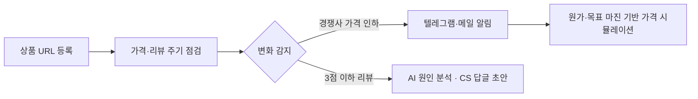
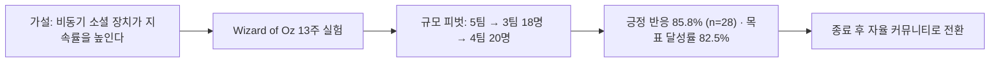

  

문제를 찾고, 직접 만들어서 확인합니다

  

<b>🇰🇷 한국어</b> · <a href="https://github.com/SUNWOOKLEE04/SUNWOOKLEE04/blob/main/README.en.md">🇺🇸 English</a>

  

<!-- TODO: 블로그·링크드인이 있으면 같은 형식으로 추가

-->

 

 

## 🧑‍💼 About

**개발을 이해하고, 직접 만들어서 검증하는 기획자** 
컴퓨터공학과 2학년 · AI 프로덕트 매니저(PM) 지망

문제를 정의하고, 가설을 세우고, 사용자 반응으로 검증한 뒤 다음 방향을 정하는 일을 좋아합니다. 기능 명세보다 "무엇을, 왜 만들어야 하는가"와 "어떻게 검증하고 키울 것인가"에 더 관심이 많습니다.

전공 덕분에 개발 흐름을 이해하고 엔지니어와 같은 언어로 이야기할 수 있고, 필요하면 AI 코딩 에이전트로 MVP를 직접 만들어 시장 반응을 확인합니다. 지금은 이커머스 셀러용 SaaS **SellerGuard**를 기획부터 개발까지 혼자 만들고 있고, 코딩 강사로 일하며 만든 수업 교재를 강사용 제품으로 다듬어 판매를 준비하고 있습니다.

| 📍 Location | 🎯 Focus | 🤝 Status |
| :---: | :---: | :---: |
| South Korea | AI Product Management | 인턴십 · 프로젝트 협업 환영 |

 

<table align="center">
<tr>
<td align="center" width="25%"><h3>🏆 대상</h3>Change Maker TR2 디자인씽킹 프로젝트</td>
<td align="center" width="25%"><h3>🧑‍🏫 2025.02~</h3>코딩 · 로보틱스 강사 현재 진행 중</td>
<td align="center" width="25%"><h3>📚 160시간</h3>딥러닝 · 생성형 AI 심화 과정 수료</td>
<td align="center" width="25%"><h3>🥇 교육감상</h3>부산 AI 경진대회 (2021)</td>
</tr>
</table>

 

## 🧭 Quick Look

| Year | Project | Role | Key Result |
| :---: | --- | :---: | --- |
| **2026~** | SellerGuard | 1인 기획·개발 | 스마트스토어 셀러용 가격·리뷰 모니터링 SaaS **개발 중** |
| **2026.10** | 강사용 수업 교재 | 기획·제작 | 자바 · 웹 표준 2종 **크몽 판매 준비 중**, 파이썬 · C · C++ · C# 4종 제작 완료 |
| **2026.09~** | GDGoC | Member | Google Developer Groups on Campus 활동 시작 |
| **2026.08** | Change Maker TR2 | 팀원 | SDGs 디자인씽킹 2박 3일 팀 프로젝트 **대상** · 수산물 직거래 아이디어 |
| **2026** | Planfit 케이스 스터디 | 동아리 프로젝트 기획 | 개발 없이 13주 행동 실험 운영 · 20명 안팎 소규모 실험 |
| **2026.06~07** | AI Grand ICT Bootcamp | Learner | 딥러닝·생성형 AI 160시간 과정 **수료** |
| **2025.02~** | Robotics & Coding Club | 코딩 강사 | 1:1·소그룹 수업 · 학생 USACO 출전 코칭 · 학생 프로젝트 지도 |
| **2021** | AI 체육 출결 시스템 | 고교 팀원 · 기획 | 부산 AI 경진대회 **교육감상** |
| **2021** | 배리어프리 키오스크 | 고교 팀원 · 기획 | ICT 해커톤 **디자인 우수상** |

 

## 🛡️ Flagship · SellerGuard

 

**스마트스토어 셀러를 위한 가격·리뷰 모니터링 SaaS** · 🔗 [sellerguard.kr](https://sellerguard.kr)

<!-- TODO: 스크린샷·데모 GIF를 레포의 assets 폴더에 올린 뒤 아래 주석을 풀어주세요

  
  

-->

**문제** · 스마트스토어 셀러는 경쟁사의 기습 가격 인하와 새 부정 리뷰를 직접 들여다봐야 해서 대응이 늦고, 그 사이 마진과 스토어 신뢰도가 깎입니다.

**타깃과 포지셔닝** · 가격 경쟁이 심한 카테고리에서 혼자 스토어를 운영하는 소규모 셀러. 기능을 늘리기보다 **"마진을 지키는 최저가 대응"** 하나에 집중했습니다.

**솔루션 흐름**

**기획 의사결정**

- **설정 장벽 최소화** · 셀러가 API 키 없이 텔레그램 Chat ID 하나로 바로 알림을 받도록 설계
- **신뢰 리스크 관리** · AI 답글이 승인되지 않은 환불·보상을 약속하지 않도록 제약 조건 적용
- **수익 모델** · 모니터링 상품 수와 점검 주기 기준 3단계 구독 요금제
- **빠른 검증** · 개발팀 없이 Antigravity·Claude Code 등 AI 코딩 에이전트로 MVP를 직접 구현

**다음 단계 (출시 후 확인할 것)**

- 베타 셀러 피드백으로 핵심 가치 검증 → 유료 전환
- 체험 가입 → 첫 알림 도달 → 유료 전환 → 이탈 순의 퍼널 지표 추적
- 결과는 이 섹션에 수치로 업데이트할 예정

<!-- TODO 출시 후: 가입자 수, 유료 고객 수, 전환율, 월 이탈률을 여기에 추가 -->

 

## 🚀 Journey

<h3>2026 · 기획과 응용 AI</h3>

### 강사용 수업 교재 제품화 — 「AP CSA로 가는 첫 자바」 · 「바로 수업하는 웹 표준」

 

**발견한 문제** · 코딩 강사로 일하면서, 처음 맡는 과목이나 전공이 아닌 과목은 수업 준비에 시간이 많이 들고 강사마다 수업 품질이 달라진다는 점을 직접 겪음

**만든 것** · 화면에 띄우면 바로 수업할 수 있는 강사용 웹 교재 6종: 자바 · 웹 표준(크몽 판매 준비) + 파이썬 · C · C++ · C#(제작 완료). AI 코딩 에이전트로 제작하고, 내용과 예제는 직접 검수
- 선생님 노트(설명 요령 · 예상 질문 · 시간 배분), 발표 모드, 차시별 수업 일정표
- 학생용 · 정답지 워크시트, 실습과 퀴즈
- 예제 코드를 실제로 컴파일 · 실행해서 확인하는 검증 스크립트
- 자바 교재는 2025-26 AP CSA 4단원 개편 내용 반영

**판매 설계** · 무료 샘플로 먼저 써보게 하고, 개인 강사용 / 소규모 학원용 / 학원 전체 3단계로 패키지를 나눔

**현재** · 실제 수업에 쓰면서 다듬는 중이며, 크몽 판매를 준비하고 있습니다. 판매 결과는 숫자로 업데이트할 예정입니다.

---

### GDGoC — Google Developer Groups on Campus

 

- **개요** · 2026년 9월부터 Google 개발자 기술을 중심으로 함께 학습하고 프로젝트를 진행하는 대학생 개발자 커뮤니티 GDGoC에서 활동 중
- **참여 목적** · 개발자들과 같은 팀에서 일하며 기술 흐름을 더 깊이 이해하고, 기획과 개발이 맞물리는 지점을 직접 경험하기 위해 참여

---

### 학습이룸 Change Maker TR2 — 수산물 직거래 아이디어 'Today-sea'

 

**개요** · 대학혁신지원사업 참여 대학 간 교류 프로그램 (2026.8.10~8.12, 2박 3일, 담양). '지속가능발전목표(SDGs)'를 주제로 실제 이슈를 이해하고 디자인씽킹 방법론으로 문제를 해결하는 팀 프로젝트 수행

**문제 정의** · 수산업 현장에서는 상품성이 낮거나 규격에 맞지 않는다는 이유로 아직 먹을 수 있는 수산물이 대량 폐기되는 반면, 소비자는 유통 단계마다 마진이 붙어 신선한 수산물을 상대적으로 비싸게 구매하는 구조적 비효율이 존재함

**아이디어** · 버려질 수산물을 어민에게서 직접 받아, 대학가 자취생 · 1인 가구에게 시세보다 싸게 연결하는 직거래 플랫폼

**활동**
- 디자인씽킹 프로젝트: 경험/주제 선정 → 사용자 공감(어민·대학상권 양측 인터뷰) → 문제 정의 → 프로토타입 & 사용자 테스트 → 결과물 발표
- 지역 문화자원을 활용한 SDGs 메시지 탐색 및 창의적 문제해결 워크숍(협력 체험) 참여
- 타 대학 학생들과의 팀빌딩 및 다학제 간 협업 경험

**결과** · 팀으로 'Today-sea' 아이디어를 기획하고 프로토타입을 만들어 최종 발표에서 **대상** 수상

**참여 목적** · 전공이 다른 학생들과 짧은 기간 안에 문제를 정하고 프로토타입까지 만들어 보기 위해 참여

🔗 [Repo](https://github.com/SUNWOOKLEE04/Today-sea)

---

### 플랜핏 케이스 스터디 — 비동기 소셜 기능 행동 실험

 

PHALANX 기획 동아리에서 진행한 자체 케이스 스터디이며, 플랜핏 회사와는 관계가 없습니다.

**질문** · 운동 앱 '플랜핏'이 미국 시장에 진출한다고 가정할 때, 사용자가 운동을 꾸준히 이어가게 하려면 무엇이 필요할까

**가설** · 같은 시간에 함께하지 않아도 서로의 운동을 느끼게 하는 비동기 소셜 장치가 지속률을 높일 것

**실행**
- '고스트 싱크(Ghost Sync)', '달성률 동기화' 등 사용자 반응 기반 비동기 소셜 기능 기획
- 5주간 기획 아티클 연재
- 개발 리소스 없이 텍스트 기반 Ghost Sync 로직을 설계하고 Wizard of Oz 방식으로 13주간 직접 검증
- 5팀 → 3팀(18명) → 4팀(20명)으로 실험 규모 피벗, 카카오톡 오픈채팅 + 구글폼/시트 자동 집계로 실사용자 데이터 수집

**결과** (참여자 20명 안팎의 소규모 실험 결과입니다)
- Ghost Ping 긍정 반응 **85.8%** (n=28)
- 하이브리드(홈트/야외) 인증 **45.2%**
- 목표 달성률 **82.5%**
- 4일차에 참여도가 40점까지 떨어진 뒤, 직접 개입해 5일차에 70점으로 회복
- 챌린지 종료 후 강제 인증을 없애고 지인 초대를 열어 자율 커뮤니티로 전환
- 개발에 들어가기 전에 행동 실험으로 가설부터 확인하는 방식을 직접 해봄

<!-- TODO: 5편 전략 아티클 링크를 여기에 추가 -->

---

### 원리로 알아가는 딥러닝 기초와 생성형 AI 활용

 

**개요** · 인공지능그랜드ICT연구센터 주관, 부산정보산업진흥원 주최 160시간(8h×5일×4주) 심화 과정 (2026.06.24 ~ 07.22)

**커리큘럼**
- 머신러닝/딥러닝 원리: 데이터 전처리, 회귀·분류·앙상블, MLP·DNN·역전파, CNN/RNN/LSTM, Transformer 구조 이해
- 생성형 AI 실전: AI 에이전트 개념, 프롬프트 설계(ROCK 기반), Gemini API 및 Supabase API 연동, 바이브 코딩으로 애플리케이션 구현
- 팀 프로젝트: 생성형 AI/딥러닝 기반 주제 선정 및 협업 실습

**수강 목적** · AI 제품이 기술적으로 어디까지 가능하고 어디서 한계에 부딪히는지 직접 체감하고, 개발팀과 정교하게 소통하기 위해 수강

<h3>2025 · 멘토링과 사용자 관찰</h3>

### 코딩 · 로보틱스 강사 — Robotics & Coding Club

 

**개요** · 2025년 2월부터 Robotics & Coding Club 학원에서 코딩·로보틱스 강사로 활동 중 (현재도 진행 중)

**활동** · 학생 개개인의 관심사와 눈높이에 맞춘 프로젝트 기반 커리큘럼 설계, 1:1/소규모 멘토링, 대회 출전 코칭

**대회 준비 지도**
- 학생 1명을 **USACO(미국 컴퓨팅 올림피아드)** / **AI SW 사고력대회** 출전까지 코칭
- 그 외 여러 학생의 코딩 · 로보틱스 대회 준비를 각자 수준에 맞춰 지도
- 직접 만든 교재(위 「강사용 수업 교재 제품화」)로 수업 진행

**지도한 학생 프로젝트** (학생이 직접 만들고 제가 지도한 작품 중 일부)

| 프로젝트 | 내용 | 링크 |
| --- | --- | :---: |
| AI-Powered Smart Bandage Platform (2025) | Gemini Vision API로 상처 상태를 평가하는 QR+웹 프로토타입 | [Repo](https://github.com/SUNWOOKLEE04/ai-wound-assessment-tool) |
| Collaborative Student Portfolio Platform (2025) | 3인 학생 팀이 만든 10+ 페이지 반응형 포트폴리오 사이트 | [Repo](https://github.com/SUNWOOKLEE04/student-portfolio) |
| Python RPG Text Game (2025) | 파이썬 기초 학습을 위한 턴제 RPG 게임 | [Repo](https://github.com/Daniel-choi-11/Python-RPG-text-game) |
| BOYNEXTDOOR Lovers Attendance Project (2026.06) | 초등학생이 좋아하는 아이돌 그룹을 소재로 함께 만든 출퇴근·스케줄 관리 콘솔 프로그램. 딕셔너리 기반 비밀번호/스케줄 바인딩, 리스트 언패킹, `.strip()` 입력 방어 코드 적용 | [Repo](https://github.com/BBIO-0530/BOYNEXTDOOR-LOVERS-ATTENDANCE-PROJECT) |

※ 일부 레포는 수업 관리를 위해 제 계정에 올려 두었지만, 모두 학생 작품입니다.

각 학생의 흥미를 학습 동기로 바꾸는 커리큘럼을 짜다 보면, 결국 사용자가 실제로 어떻게 움직이는지부터 관찰하게 됩니다. 학업·편입 준비와 병행하면서도 2025년 2월부터 꾸준히 이어온 활동입니다.

---

### PHALANX 기획 동아리 (2025~)

위 플랜핏 케이스 스터디를 진행한 기획 동아리로, 2025년부터 활동 중입니다.

<h3>2024 · 기업 연계 활동과 역량 강화</h3>

### CAHLP 기업 연계 동아리 — B2B 비즈니스 경험

- **B2B 네트워킹** · K-ICT Week(BEXCO)에 참여해 IT 기업들과 교류하며 B2B 비즈니스 현장을 경험
- **동아리 과제** · 연습용 앱 제작 ([toonflix](https://github.com/SUNWOOKLEE04/toonflix), [naver_map_weather](https://github.com/SUNWOOKLEE04/naver_map_weather))

---

### 어학연수 & 데이터·AI 과정

 

- 🌏 **CEBU LCIC 연수** (여름방학, 1개월) — 어학연수를 통한 영어 커뮤니케이션 역량 강화
- 📊 **DSAC M2/M3 수료** — 데이터 사이언스 및 AI 활용 역량 강화 프로그램

<h3>2021 · 고교 시절 프로젝트</h3>

### AI 카메라 기반 체육 출결 시스템

고교 팀 프로젝트 · 기획 담당

- **문제** · 비대면 체육 수업에서 출결 확인이 어렵고 학생 활동량이 줄어듦
- **한 일** · AI 모션 인식으로 출결을 자동 처리하는 서비스 흐름 기획, 팀 일정 조율
- **결과** · 부산 AI 경진대회 **교육감상** 수상

---

### 시각장애인을 위한 지능형 키오스크

고교 팀 프로젝트 · 기획 담당

- **문제** · 시각장애인이 키오스크를 혼자 쓰기 어려움
- **한 일** · 음성 인식 · 점자를 지원하는 키오스크 화면 기획과 프로토타입 제작
- **결과** · ICT 해커톤 **디자인 우수상** 수상

🔗 [Repository](https://github.com/SUNWOOKLEE04/Intelligent-Kiosk-System)

---

### 장애인 맞춤형 생활체육 추천 시스템

고교 팀 프로젝트 · 기획 담당

- **문제** · 장애인이 자신에게 맞는 생활체육 정보를 찾기 어려움
- **한 일** · 공공 데이터를 활용한 맞춤 생활체육 추천 서비스 흐름 기획
- **결과** · **입상**

---

### PNU 데이터톤

- 팀 데이터 분석 프로젝트 참여

 

## 🛠️ Toolkit

  

| 영역 | 도구 |
| --- | --- |
| **주로 쓰는 것** |   |
| **가르치고 교재로 만든 것** |       |
| **서버 · 인프라** |    |
| **AI 개발 도구** |     |
| **자동화** |  |
| **기록 · 정리** |   |

 

## 📖 Current Focus

SellerGuard 출시 · 강사용 교재 판매 · GDGoC에서 개발자와 함께 공부하기

 

<h2>📊 Activity</h2>

  <picture>
    <source media="(prefers-color-scheme: dark)" srcset="https://streak-stats.demolab.com/?user=SUNWOOKLEE04&theme=tokyonight&hide_border=true&background=1a1b27&stroke=70a5fd&ring=00B4D8&fire=00B4D8">
    <source media="(prefers-color-scheme: light)" srcset="https://streak-stats.demolab.com/?user=SUNWOOKLEE04&theme=default&hide_border=true&ring=090979&fire=0096C7&currStreakNum=090979">
    
  </picture>

<!-- 활동 그래프: github-readme-activity-graph.vercel.app 서비스가 2026년 8월 말부터 중단(402 DEPLOYMENT_DISABLED)되어 잠시 숨겨둠.
     서비스가 복구되거나 GitHub Actions로 직접 생성하게 되면 아래 주석을 풀어서 다시 사용.

  

-->

  <picture>
    <source media="(prefers-color-scheme: dark)" srcset="https://raw.githubusercontent.com/SUNWOOKLEE04/SUNWOOKLEE04/output/github-contribution-grid-snake-dark.svg">
    <source media="(prefers-color-scheme: light)" srcset="https://raw.githubusercontent.com/SUNWOOKLEE04/SUNWOOKLEE04/output/github-contribution-grid-snake.svg">
    
  </picture>

  

  

