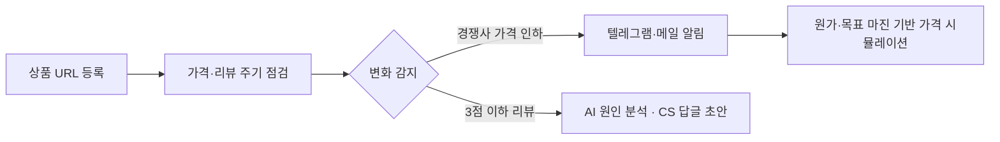
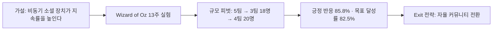

  

기술, 제품 전략, 사용자 행동을 연결합니다 · 가설을 세우고 성장 루프를 설계합니다

  

<b>🇰🇷 한국어</b> · <a href="https://github.com/SUNWOOKLEE04/SUNWOOKLEE04/blob/main/README.en.md">🇺🇸 English</a>

  

<!-- TODO: 블로그·링크드인이 있으면 같은 형식으로 추가

-->

 

 

## 🧑‍💼 About

**개발을 이해하고, 직접 만들어서 검증하는 기획자** 
컴퓨터공학과 2학년 · AI 프로덕트 매니저(PM) 지망

문제를 정의하고, 가설을 세우고, 사용자 반응으로 검증한 뒤 다음 방향을 정하는 일을 좋아합니다. 기능 명세보다 "무엇을, 왜 만들어야 하는가"와 "어떻게 검증하고 키울 것인가"에 더 관심이 많습니다.

전공 덕분에 개발 흐름을 이해하고 엔지니어와 같은 언어로 이야기할 수 있고, 필요하면 AI 코딩 에이전트로 MVP를 직접 만들어 시장 반응을 확인합니다. 지금은 이커머스 셀러용 SaaS **SellerGuard**를 기획부터 출시까지 혼자 진행하고 있습니다. 국내 채용뿐 아니라 해외 진출까지 염두에 두고 커리어를 준비하고 있습니다.

| 📍 Location | 🎯 Focus | 🤝 Status |
| :---: | :---: | :---: |
| South Korea | AI Product Management | Open to Work (KR / Global) |

 

<table align="center">
<tr>
<td align="center" width="25%"><h3>🏆 대상</h3>Change Maker TR2 디자인씽킹 프로젝트</td>
<td align="center" width="25%"><h3>🧪 13주</h3>개발 없이 진행한 행동 실험</td>
<td align="center" width="25%"><h3>📈 85.8%</h3>Ghost Ping 긍정 반응 (n=28)</td>
<td align="center" width="25%"><h3>🚀 2026.10</h3>SellerGuard SaaS 출시 목표</td>
</tr>
</table>

 

## 🧭 Quick Look

| Year | Project | Role | Key Result |
| :---: | --- | :---: | --- |
| **2026.10** | SellerGuard | Founder · PM | 스마트스토어 셀러용 가격·리뷰 모니터링 SaaS 기획·MVP 개발, **10월 출시 목표** |
| **2026.09~** | GDGoC | Member | Google Developer Groups on Campus 활동 시작 |
| **2026.08** | Change Maker TR2 | Product Planner | SDGs 디자인씽킹 프로젝트 **대상** · 어민-대학상권 직납 B2B 플랫폼 기획 |
| **2026** | Planfit 케이스 스터디 | Product Planner | 개발 없이 13주 행동 실험 · Ghost Ping 긍정 반응 **85.8%** · 하이브리드 인증 **45.2%** |
| **2026.06~07** | AI Grand ICT Bootcamp | Learner | 딥러닝·생성형 AI 160시간 과정 **수료** |
| **2025.02~** | Robotics & Coding Club | Coding Instructor | 학생 USACO·AI SW 사고력대회 출전 코칭 · 다수 프로젝트 지도 |
| **2021** | AI PE Attendance System | Product Planner | 부산 AI 경진대회 **교육감상** |
| **2021** | Barrier-free Kiosk | Product Planner | ICT 해커톤 **디자인 우수상** |

 

## 🛡️ Flagship · SellerGuard

 

**스마트스토어 셀러를 위한 가격·리뷰 모니터링 SaaS** · 🔗 [sellerguard.kr](https://sellerguard.kr)

<!-- TODO: 스크린샷·데모 GIF를 레포의 assets 폴더에 올린 뒤 아래 주석을 풀어주세요

  
  

-->

**문제** · 스마트스토어 셀러는 경쟁사의 기습 가격 인하와 새 부정 리뷰를 직접 들여다봐야 해서 대응이 늦고, 그 사이 마진과 스토어 신뢰도가 깎입니다.

**타깃과 포지셔닝** · 가격 경쟁이 심한 카테고리에서 혼자 스토어를 운영하는 소규모 셀러. 기능을 늘리기보다 **"마진을 지키는 최저가 대응"** 하나에 집중했습니다.

**솔루션 흐름**

**기획 의사결정**

- **설정 장벽 최소화** · 셀러가 API 키 없이 텔레그램 Chat ID 하나로 바로 알림을 받도록 설계
- **신뢰 리스크 관리** · AI 답글이 승인되지 않은 환불·보상을 약속하지 않도록 제약 조건 적용
- **수익 모델** · 모니터링 상품 수와 점검 주기 기준 3단계 구독 요금제
- **빠른 검증** · 개발팀 없이 Antigravity·Claude Code 등 AI 코딩 에이전트로 MVP를 직접 구현

**다음 단계 (출시 후 검증 계획)**

- 베타 셀러 피드백으로 핵심 가치 검증 → 유료 전환
- 체험 가입 → 첫 알림 도달 → 유료 전환 → 이탈 순의 퍼널 지표 추적
- 결과는 이 섹션에 수치로 업데이트할 예정

<!-- TODO 출시 후: 가입자 수, 유료 고객 수, 전환율, 월 이탈률을 여기에 추가 -->

 

## 🚀 Journey

<h3>2026 · 기획과 응용 AI</h3>

### GDGoC — Google Developer Groups on Campus

 

- **개요** · 2026년 9월부터 Google 개발자 기술을 중심으로 함께 학습하고 프로젝트를 진행하는 대학생 개발자 커뮤니티 GDGoC에서 활동 중
- **참여 목적** · 개발자들과 같은 팀에서 일하며 기술 흐름을 더 깊이 이해하고, 기획과 개발이 맞물리는 지점을 직접 경험하기 위해 참여

---

### 학습이룸 Change Maker TR2 — 어민-대학상권 직납 B2B 플랫폼 'Today-sea'

 

**개요** · 대학혁신지원사업 참여 대학 간 교류 프로그램 (2026.8.10~8.12, 2박 3일, 담양). '지속가능발전목표(SDGs)'를 주제로 실제 이슈를 이해하고 디자인씽킹 방법론으로 문제를 해결하는 팀 프로젝트 수행

**문제 정의** · 수산업 현장에서는 상품성이 낮거나 규격에 맞지 않는다는 이유로 아직 먹을 수 있는 수산물이 대량 폐기되는 반면, 소비자는 유통 단계마다 마진이 붙어 신선한 수산물을 상대적으로 비싸게 구매하는 구조적 비효율이 존재함

**전략** · 어민과 대학상권(자취생·1인 가구 중심 소비 밀집 지역)을 하나의 채널로 직접 연결해, 기존 다단계 유통 구조를 **1단계 직납 구조**로 압축하는 B2B 플랫폼을 설계. 버려질 뻔한 수산물을 저비용에 확보해 정상 판매하는 동시에, 학생 소비자에게는 시세 대비 합리적인 가격을 제공하는 양면 시장(Two-sided market) 모델로 문제를 재정의

**활동**
- 디자인씽킹 프로젝트: 경험/주제 선정 → 사용자 공감(어민·대학상권 양측 인터뷰) → 문제 정의 → 프로토타입 & 사용자 테스트 → 결과물 발표
- 지역 문화자원을 활용한 SDGs 메시지 탐색 및 창의적 문제해결 워크숍(협력 체험) 참여
- 타 대학 학생들과의 팀빌딩 및 다학제 간 협업 경험

**성과** · 버려지는 수산물을 살리고 유통 단계를 1단계로 압축한 **어민-대학상권 직납 B2B 플랫폼('Today-sea')** 기획 및 프로토타입 제작 ➔ 최종 결과물 발표에서 **대상 수상**

**참여 목적** · 전공과 배경이 다른 학생들과 짧은 기간 안에 문제를 정의하고 프로토타입까지 만들어보며, 빠른 가설 검증과 협업 커뮤니케이션 역량을 기르고자 참여

🔗 [Repo](https://github.com/SUNWOOKLEE04/Today-sea)

---

### 플랜핏 케이스 스터디 — 글로벌 유저 리텐션 & 소셜 기능 전략

 

PHALANX 기획 동아리에서 진행한 자체 케이스 스터디입니다.

**문제** · 글로벌 피트니스 앱 '플랜핏'이 미국 시장에 진입하고 유저 리텐션을 높이려면 '지속 가능한 운동 구조'가 필요

**가설** · 같은 시간에 함께하지 않아도 서로의 운동을 느끼게 하는 비동기 소셜 장치가 지속률을 높일 것

**실행**
- '고스트 싱크(Ghost Sync)', '달성률 동기화' 등 사용자 반응 기반 비동기 소셜 기능 기획
- 5주간 전략 아티클 연재
- 개발 리소스 없이 텍스트 기반 Ghost Sync 로직을 설계하고 Wizard of Oz 방식으로 13주간 직접 검증
- 5팀 → 3팀(18명) → 4팀(20명)으로 실험 규모 피벗, 카카오톡 오픈채팅 + 구글폼/시트 자동 집계로 실사용자 데이터 수집

**성과**
- Ghost Ping 긍정 반응 **85.8%** (n=28)
- 하이브리드(홈트/야외) 인증 **45.2%**
- 목표 달성률 **82.5%**
- 4일차 참여도 최저점(40점) 이후 수동 개입으로 5일차 70점 반등 견인
- 챌린지 종료 후 강제 인증 폐지·지인 초대 개방으로 **자율 커뮤니티 전환(Exit 전략)** 설계
- 개발 착수 전 행동 실험으로 가설을 검증해 실행 리스크를 사전에 축소

<!-- TODO: 5편 전략 아티클 링크를 여기에 추가 -->

---

### 원리로 알아가는 딥러닝 기초와 생성형 AI 활용

 

**개요** · 인공지능그랜드ICT연구센터 주관, 부산정보산업진흥원 주최 160시간(8h×5일×4주) 심화 과정 (2026.06.24 ~ 07.22)

**커리큘럼**
- 머신러닝/딥러닝 원리: 데이터 전처리, 회귀·분류·앙상블, MLP·DNN·역전파, CNN/RNN/LSTM, Transformer 구조 이해
- 생성형 AI 실전: AI 에이전트 개념, 프롬프트 설계(ROCK 기반), Gemini API 및 Supabase API 연동, 바이브 코딩으로 애플리케이션 구현
- 팀 프로젝트: 생성형 AI/딥러닝 기반 주제 선정 및 협업 실습

**수강 목적** · AI 제품이 기술적으로 어디까지 가능하고 어디서 한계에 부딪히는지 직접 체감하고, 개발팀과 정교하게 소통하기 위해 수강

<h3>2025 · 멘토링과 사용자 관찰</h3>

### 코딩 · 로보틱스 강사 — Robotics & Coding Club

 

**개요** · 2025년 2월부터 Robotics & Coding Club 학원에서 코딩·로보틱스 강사로 활동 중 (현재도 진행 중)

**활동** · 학생 개개인의 관심사와 눈높이에 맞춘 프로젝트 기반 커리큘럼 설계, 1:1/소규모 멘토링, 대회 출전 코칭

**대회 준비 지도**
- 학생 1명을 **USACO(미국 컴퓨팅 올림피아드)** / **AI SW 사고력대회** 출전까지 코칭
- 그 외 다수 학생들도 각자 수준에 맞춰 코딩·로보틱스 대회 준비 지도 중 → 여러 건의 **대회 참가·수상** 성과로 이어짐

**프로젝트 하이라이트** (전체 중 일부 예시)

| 프로젝트 | 내용 | 링크 |
| --- | --- | :---: |
| AI-Powered Smart Bandage Platform (2025) | Gemini Vision API로 상처 상태를 평가하는 QR+웹 프로토타입 | [Repo](https://github.com/SUNWOOKLEE04/ai-wound-assessment-tool) |
| Collaborative Student Portfolio Platform (2025) | 3인 학생 팀이 만든 10+ 페이지 반응형 포트폴리오 사이트 | [Repo](https://github.com/SUNWOOKLEE04/student-portfolio) |
| Python RPG Text Game (2025) | 파이썬 기초 학습을 위한 턴제 RPG 게임 | [Repo](https://github.com/Daniel-choi-11/Python-RPG-text-game) |
| BOYNEXTDOOR Lovers Attendance Project (2026.06) | 초등학생이 좋아하는 아이돌 그룹을 소재로 함께 만든 출퇴근·스케줄 관리 콘솔 프로그램. 딕셔너리 기반 비밀번호/스케줄 바인딩, 리스트 언패킹, `.strip()` 입력 방어 코드 적용 | [Repo](https://github.com/BBIO-0530/BOYNEXTDOOR-LOVERS-ATTENDANCE-PROJECT) |

※ 위는 대표 사례이며, 이 외에도 여러 학생들과 함께 진행 중인 프로젝트가 더 있습니다.

각 학생의 흥미를 학습 동기로 바꾸는 커리큘럼을 짜다 보면, 결국 사용자가 실제로 어떻게 움직이는지부터 관찰하게 됩니다. 학업·편입 준비와 병행하면서도 2025년 2월부터 꾸준히 이어온 활동입니다.

---

### PHALANX 기획 동아리 (2025~)

위 플랜핏 케이스 스터디를 진행한 기획 동아리로, 2025년부터 활동 중입니다.

<h3>2024 · 기업 연계 활동과 역량 강화</h3>

### CAHLP 기업 연계 동아리 — IT 기획 참여

- 관상어 산업 기업 대표와 직접 소통하며 기업의 IT 도입 방향을 함께 기획
- 기업 맞춤형 IT 제안서 작성에 참여
- K-ICT Week(BEXCO)에서 B2B 네트워킹 참여

---

### 글로벌 인사이트 & 데이터·AI 역량 강화

 

- 🌏 **CEBU LCIC 연수** (여름방학, 1개월) — 어학연수를 통한 영어 커뮤니케이션 역량 강화
- 📊 **DSAC M2/M3 수료** — 데이터 사이언스 및 AI 활용 역량 강화 프로그램

<h3>2021 · 고교 시절 프로젝트</h3>

### AI 카메라 기반 체육 출결 시스템

- **문제** · 비대면 체육 수업의 출결 관리 한계 및 학생 활동량 저하
- **전략** · AI 모션 인식 기반 자동 출결 비즈니스 로직 기획 및 교차 직군(Dev/Design) 일정 리딩
- **성과** · 에듀테크 솔루션 MVP 실효성 입증 ➔ 부산 AI 경진대회 **교육감상 수상**

---

### 시각장애인을 위한 지능형 키오스크

- **문제** · 시각장애인의 키오스크 접근성 부족 및 페인포인트(Pain-point) 도출
- **전략** · 음성인식/점자 지원 배리어프리 UI/UX 기획 및 프로토타이핑
- **성과** · 사회적 약자를 위한 UX 개선 검증 ➔ ICT 해커톤 **디자인 우수상 수상**

🔗 [Repository](https://github.com/SUNWOOKLEE04/Intelligent-Kiosk-System)

---

### 장애인 맞춤형 생활체육 추천 시스템

- **문제** · 장애인 개인 특성에 최적화된 맞춤형 생활체육 인프라 및 정보 부재
- **전략** · 공공 빅데이터 기반 추천 알고리즘 서비스 플로우 설계 및 데이터-앱 연동 기획
- **성과** · 데이터 활용성 및 헬스케어 확장성 입증 ➔ **입상**

---

### PNU 데이터톤

- 팀 단위 데이터 사이언스 실무 프로젝트 기획 및 데이터 인사이트 도출

 

## 🛠️ Toolkit

  

| 영역 | 도구 |
| --- | --- |
| **기획 & 협업** |      |
| **데이터 & 검증** |     |
| **AI & 프로토타이핑** |       |
| **개발 이해** (개발자와 소통하기 위해 다뤄본 기술) |     |

 

## 📖 Current Focus

     

 

<h2>📊 Activity</h2>

  <picture>
    <source media="(prefers-color-scheme: dark)" srcset="https://streak-stats.demolab.com/?user=SUNWOOKLEE04&theme=tokyonight&hide_border=true&background=1a1b27&stroke=70a5fd&ring=00B4D8&fire=00B4D8">
    <source media="(prefers-color-scheme: light)" srcset="https://streak-stats.demolab.com/?user=SUNWOOKLEE04&theme=default&hide_border=true&ring=090979&fire=0096C7&currStreakNum=090979">
    
  </picture>

<!-- 활동 그래프: github-readme-activity-graph.vercel.app 서비스가 2026년 8월 말부터 중단(402 DEPLOYMENT_DISABLED)되어 잠시 숨겨둠.
     서비스가 복구되거나 GitHub Actions로 직접 생성하게 되면 아래 주석을 풀어서 다시 사용.

  

-->

  <picture>
    <source media="(prefers-color-scheme: dark)" srcset="https://raw.githubusercontent.com/SUNWOOKLEE04/SUNWOOKLEE04/output/github-contribution-grid-snake-dark.svg">
    <source media="(prefers-color-scheme: light)" srcset="https://raw.githubusercontent.com/SUNWOOKLEE04/SUNWOOKLEE04/output/github-contribution-grid-snake.svg">
    
  </picture>

  

  

